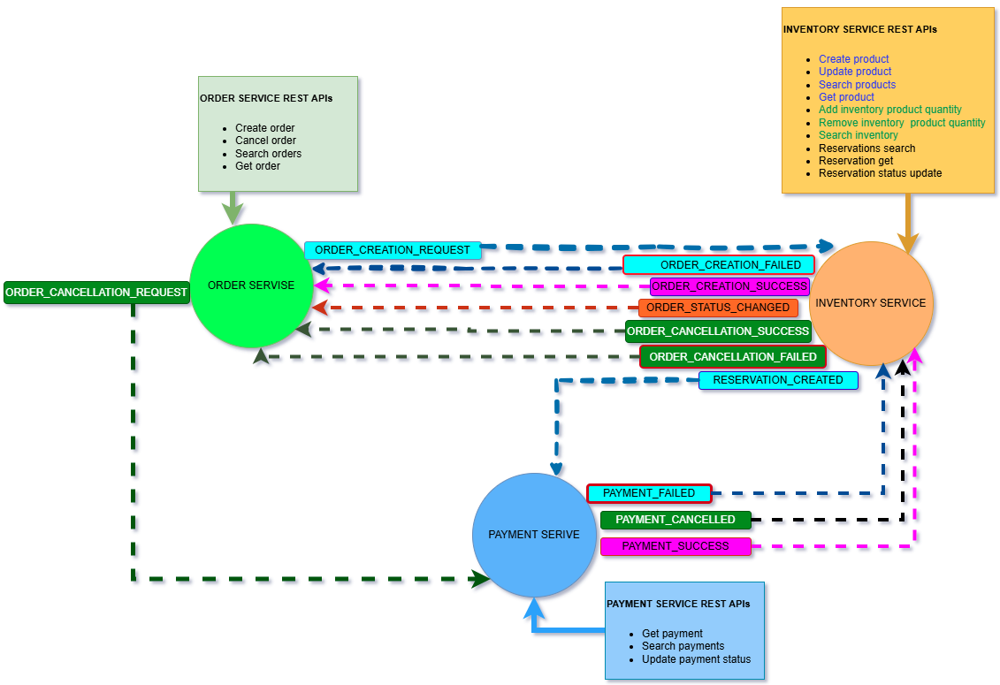

# Order Management Microservices System

## Architecture Overview



---

## Technologies Used

- Java 17
- Spring Boot 3.3
- Apache Kafka
- MySQL
- Saga Design Pattern
- 

---

# Microservices

## 1. Order Service

Handles creating and cancelling orders.

### REST APIs

* `POST /orders` - Create a new order
* `GET /orders` - Get list of all orders
* `GET /orders/{id}` - Get details of a specific order
* `PATCH /orders/{id}/cancel` - Cancel an existing order

### Kafka Events Sent

* `ORDER_CREATION_REQUEST` - Emit order creation data to the Inventory Service
* `ORDER_CANCELLATION_REQUEST` - Emit order cancellation request to the Payment Service

### Kafka Events Received

* `ORDER_STATUS_CHANGED` - Update the order's status based on inventory results (e.g., NOT\_ENOUGH\_INVENTORY, RESERVED\_AWAITING\_PAYMENT)
* `ORDER_CREATION_SUCCESS` - Mark the order as successfully created and paid
* `ORDER_CREATION_FAILED` - Mark the order as failed (due to payment failure, invalid data, etc.)
* `ORDER_CANCELLATION_SUCCESS` - Mark the order as successfully cancelled
* `ORDER_CANCELLATION_FAILED` - Mark the order as cancellation failed

---

## 2. Inventory Service

Manages product data, inventory levels, and reservation logic.

### REST APIs

* `POST /products` - Add a new product
* `PATCH /products/{id}` - Update name, price, or status of a product
* `GET /products` - Get list of all products
* `GET /products/{id}` - Get details of a specific product
* `GET /inventory` - View or search current inventory data
* `PATCH /inventory/product/{productCode}/add` - Increase stock of a specific product
* `PATCH /inventory/product/{productCode}/remove` - Decrease stock of a specific product
* `GET /reservations` - Get list of all reservations
* `GET /reservations/{id}` - Get details of a specific reservation
* `PATCH /reservations/orders/{orderId}/status` - Update reservation status (only to "DELIVERY" status)

### Kafka Events Sent

* `RESERVATION_CREATED` - Sent after reserving inventory for an order
* `ORDER_STATUS_CHANGED` - Sent when reservation status changes (used to update order process)
* `ORDER_CREATION_SUCCESS` - Sent when inventory reservation and payment succeed
* `ORDER_CREATION_FAILED` - Sent if reservation or payment fails
* `ORDER_CANCELLATION_SUCCESS` - Sent after inventory is successfully released during cancellation
* `ORDER_CANCELLATION_FAILED` - Sent if inventory release fails during cancellation

### Kafka Events Received

* `ORDER_CREATION_REQUEST` - Received to create a pending reservation for a new order
* `PAYMENT_FAILED` - Received to revert reservation and update status when payment fails
* `PAYMENT_CANCELLED` - Received to cancel reservation and release stock when payment is cancelled
* `PAYMENT_SUCCESS` - Received to confirm the reservation and update status for delivery

---

## 3. Payment Service

Handles payment processing and updates.

### REST APIs

* `GET /payments/{id}` - Get details of a specific payment
* `GET /payments` - Get list of all payments
* `PATCH /payments/orders/{orderId}/status` - Update payment status (only as payment success or failed)

### Kafka Events Sent

* `PAYMENT_SUCCESS` - Sent when payment is successfully completed
* `PAYMENT_FAILED` - Sent when payment processing fails
* `PAYMENT_CANCELLED` - Sent when a payment is cancelled

### Kafka Events Received

* `ORDER_CANCELLATION_REQUEST` - Received to process cancellation and update payment if needed
* `RESERVATION_CREATED` - Received to initiate payment processing after reservation is made

---

## Saga Pattern

The Saga pattern is used to coordinate the steps of order fulfillment:

1. When an order is created, an event is sent to reserve inventory.
2. After inventory is reserved, an event is sent to process payment.
3. If payment is successful, the order is completed.
4. If there is any failure (inventory or payment), the system sends events to cancel or reverse the previous steps:
   - Cancel the inventory reservation
   - Refund the payment
   - Cancel the order

---

## Testing

You can use the provided Postman collection to test the end-to-end Saga workflow across microservices.

[Download Postman Collection (saga.postman_collection.json)](./saga.postman_collection.json)

---

## How to Run the Project

### Prerequisites

- Java 17
- Apache Kafka and Zookeeper (running locally or via Docker)
- Maven

### Steps

1. Clone the repository

   ```bash
   git clone https://github.com/your-username/order-management-microservices.git
   cd order-management-microservices

2. Start Kafka and Zookeeper
3. Start each service one by one using the terminal or your IDE:

 ```cd order-service
mvn spring-boot:run

cd ../inventory-service
mvn spring-boot:run

cd ../payment-service
mvn spring-boot:run
```

4. Use tools like Postman or Swagger to test the APIs.

## Tested scenarios 

1. Create Order with Available Inventory and Successful Payment
   - Expected: Order Confirmed

2. Create Order with Insufficient Inventory
   - Expected: Order Failed

3. Create Order with Non-existent Product
   - Expected: Order Failed

4. Create Order with Inventory Available but Payment Fails
   - Expected: Order Cancelled, Inventory Released

6. Cancel Order Before Payment
   - Expected: Inventory Released, No Payment Triggered

7. Cancel Order After Payment
   - Expected: Payment Refunded, Inventory Released, Order Cancelled Confirmed

8. Force Payment Refund for an Existing Paid Order
   - Expected: Refund Processed, Order Updated

9. Fetch Order Status After Saga Completion
   - Expected: Correct Final Status (CREATION_FAILED / CREATION_SUCCESS / CANCELLATION_SUCCESS)

10. Search Orders by orderId, productCode, ...
    - Expected: Correct List Returned

11. Retry Payment After Temporary Failure
    - Expected: Order Creation success if Payment Succeeds

12. Retry Inventory Reservation After Initial Failure
    - Expected: Order Creation Success if Retry Succeeds

13. Create Order with Quantity Greater than Available Stock
    - Expected: Order Failed Immediately

14. Create Multiple Orders Simultaneously (Concurrency Test)
    - Expected: Only Available Inventory Is Allocated, Rest Fail

15. Simulate Event Delivery Delay Between Services
    - Expected: Eventual Consistency Maintained

16. Inventory Reserved but Order Cancelled Before Payment
    - Expected: Inventory Released Successfully

17. Payment Service Down During Order Flow
    - Expected: Saga Aborted, Order is processing state, Inventory Released

18. Inventory Service Down During Order Flow
    - Expected: Saga Aborted, Order is processing state

19. Simulate Kafka Message Loss
    - Expected: Saga Timeout or Compensating Transaction Triggered

20. Simulate Duplicate Events (Idempotency Test)
    - Expected: System Handles Gracefully, No Duplicates

21. Payment Success Event Received Twice
    - Expected: No Duplicate Records, return an error message to 2nd

22. Inventory Reserved Event Received Late
    - Expected: Saga Still Proceeds if Not Timed Out

23. Invalid Order Data (e.g., negative quantity)
    - Expected: Validation Failure, No Saga Triggered, Order creation failed

24. Cancel Non-Existing Order
    - Expected: Validation Failure, No Saga Triggered, Order creation failed

25. Try to Cancel Already Cancelled Order
    - Expected: Return validation failure response


